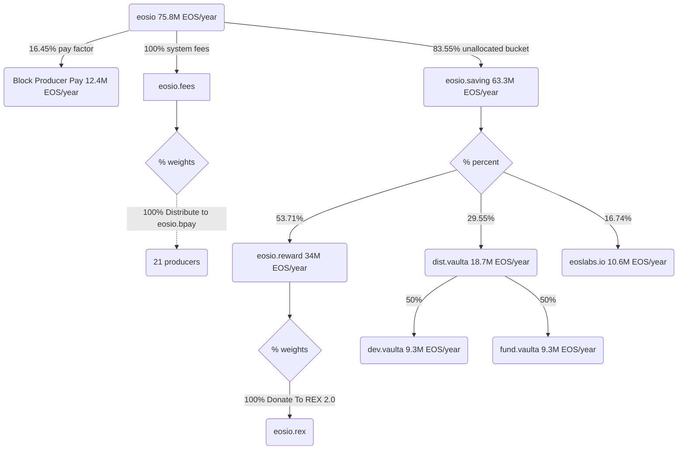

# Distribution Contract, Configuration, and Foundation Accounts

> Configure distribution contracts and update former Foundation accounts.

## Overview

This proposal seeks to:

1. Unlock a funding mechanism for the core development team
2. Transfers control of fund.wram to the network authority
3. Transfers control of eosio.mware to the network authority

### 1. Development Team Funding

All of the accounts listed below are owned by the network.

- `eosio.saving` retains its current distribution ratios
- `dist.vaulta` receives partial distribution and can redistribute
- `dev.vaulta` claims and allocates to development team accounts

The `dev.vaulta` account is owned by the network but accessible by the development team. The active permission will be updated to a VDT multi-sig (either 2-of-3 or 3-of-5 as defined by Areg, to be confirmed before MSIG 2 execution).

This configuration can be temporary. At the time of this proposal it is undecided on how this configuration operates long term. This initial configuration is designed to provide a bucket to bootstrap the core development team.

Once the team is established, further review of the configuration can take place.

### 2. The fund.wram account

This is a 2-of-2 msig between the Foundation and Labs in stalemate.

Without a solution on how to use this account, this proposal will simply replace the active permission with `eosio@active`. 

This step is being taken to remove control from the Foundation account, without needing to decide on the fate of the account.

### 3. The eosio.mware account

This is a 2-of-2 msig between the Foundation and Labs in stalemate.

Without a solution on how to use this account, this proposal will simply replace the active permission with `eosio@active`. 

This step is being taken to remove control from the Foundation account, without needing to decide on the fate of the account.

### Fund Distribution Flow



### Allocations

| Sender | Receiver | Allocation (%)| 
|--------|----------|---------------|
| eosio | eosio.saving | 83.55% |
| eosio | producer pay | 16.45% |
| eosio.saving | eosio.reward | 53.71% |
| eosio.saving | dist.vaulta | 29.55% |
| eosio.saving | eoslabs.io | 16.74% |
| dist.vaulta | dev.vaulta | 50% |
| dist.vaulta | fund.vaulta | 50% |

### Account Structure

**dev.vaulta** - Development team multi-sig account
- Owner: eosio@active (15 of 21 Block Producers)
- Active: VDT multi-sig (updated in this proposal)
    - Structure will be either 2-of-3 or 3-of-5 as defined by Areg
    - Signers to be confirmed before MSIG 2 execution

**dist.vaulta** - Distribution contract account
- Owner: eosio@active (15 of 21 Block Producers)
- Active: eosio@active (15 of 21 Block Producers)
- Runs eosio.saving contract
- Distributes 50% to dev.vaulta, 50% to fund.vaulta

**fund.vaulta** - Unallocated funds account
- Owner: eosio@active (15 of 21 Block Producers)
- Active: eosio@active (15 of 21 Block Producers)
- Receives 50% of distribution from dist.vaulta

### MSIG - Development Team Setup

> Note: Accounts `dev.vaulta`, `dist.vaulta`, and `fund.vaulta` should already exist before this proposal is made.

#### Allocate Resources

- [x] 1.1 Buy RAM for `dist.vaulta` contract

**buyrambytes**
```json
{
    "bytes": 200000,
    "payer": "eosio",
    "receiver": "dist.vaulta"
}
```

#### Deploy Distribution Contract

- [x] 2.1 Deploy `eosio.saving` contract to `dist.vaulta`
- [x] 2.2 Set contract ABI for `dist.vaulta`

**setcode**
```json
{
    "account": "dist.vaulta",
    "code": "build/contracts/eosio.saving/eosio.saving.wasm",
    "vmtype": 0,
    "vmversion": 0
}
```

**setabi**
```json
{
    "account": "dist.vaulta",
    "abi": "build/contracts/eosio.saving/eosio.saving.abi"
}
```

#### Configure Distribution Strategies

- [x] 3.1 Configure `dist.vaulta` to distribute 50% to `dev.vaulta` and 50% to `fund.vaulta`

**dist.vaulta::setdistrib**
```json
{
    "accounts": [
        {
            "account": "dev.vaulta",
            "percent": 5000
        },
        {
            "account": "fund.vaulta",
            "percent": 5000
        }
    ]
}
```

- [x] 3.2 Update `eosio.saving` distribution to include `dist.vaulta` (29.55%)

**eosio.saving::setdistrib**
```json
{
    "accounts": [
        {
            "account": "eosio.reward",
            "percent": 5371
        },
        {
            "account": "dist.vaulta",
            "percent": 2955
        },
        {
            "account": "eoslabs.io",
            "percent": 1674
        }
    ]
}
```

#### Update Permissions

- [x] 4.1 Update `dev.vaulta` active permission to VDT multi-sig

**updateauth**

The exact multi-sig structure will be either 2-of-3 or 3-of-5 as defined by Areg before MSIG 2 execution.

Example structure (placeholder - MUST be updated before execution):
```json
{
    "account": "dev.vaulta",
    "auth": {
        "threshold": 2,
        "keys": [],
        "accounts": [
            {
                "weight": 1,
                "permission": {
                    "actor": "ahayrapetian",
                    "permission": "active"
                }
            },
            {
                "weight": 1,
                "permission": {
                    "actor": "tbd1",
                    "permission": "active"
                }
            },
            {
                "weight": 1,
                "permission": {
                    "actor": "tbd2",
                    "permission": "active"
                }
            }
        ],
        "waits": []
    },
    "permission": "active",
    "parent": "owner"
}
```

**Note**: Add additional accounts if using 3-of-5 structure. Update threshold accordingly.

- [x] 4.2 Update `fund.wram` active permission to network authority (replace eosio.grants@active with eosio@active)

**updateauth**
```json
{
    "account": "fund.wram",
    "auth": {
        "threshold": 1,
        "keys": [],
        "accounts": [
            {
                "weight": 1,
                "permission": {
                    "actor": "eosio",
                    "permission": "active"
                }
            }
        ],
        "waits": []
    },
    "permission": "active",
    "parent": "owner"
}
```

- [x] 4.3 Update `eosio.mware` active permission to network authority (replace existing permission with eosio@active)

**updateauth**
```json
{
    "account": "eosio.mware",
    "auth": {
        "threshold": 1,
        "keys": [],
        "accounts": [
            {
                "weight": 1,
                "permission": {
                    "actor": "eosio",
                    "permission": "active"
                }
            }
        ],
        "waits": []
    },
    "permission": "active",
    "parent": "owner"
}
```

- [x] 4.4 Create `devclaim` permission on `dist.vaulta` for development team

**updateauth**
```json
{
    "account": "dist.vaulta",
    "auth": {
        "threshold": 1,
        "keys": [],
        "accounts": [
            {
                "weight": 1,
                "permission": {
                    "actor": "dev.vaulta",
                    "permission": "active"
                }
            }
        ],
        "waits": []
    },
    "permission": "devclaim",
    "parent": "active"
}
```

- [x] 4.5 Link `devclaim` permission to only allow calling `eosio.saving::claim`

**linkauth**
```json
{
    "account": "dist.vaulta",
    "code": "eosio.saving",
    "type": "claim",
    "requirement": "devclaim"
}
```

### Build & Verify

This proposal deploys a contract identical to the `eosio.saving` contract on to the `dist.vaulta` account. 

#### Building eosio.saving

The `eosio.saving` account can be built using the CDT from:

https://github.com/VaultaFoundation/eosio.saving

#### Retrieve eosio.saving hash

The contract hash that previously was deployed by BPs can be used to also verify the expected hash.

```bash
# Get hash for the existing contract
curl https://eos.greymass.com/v1/chain/get_code_hash -d '{"account_name":"eosio.saving"}'
```

#### Verify Contract Hash

Verify the WASM file in this project to ensure the hash matches the expected value:

```bash
# Calculate SHA256 hash of the built contract
shasum -a 256 build/contracts/eosio.saving/eosio.saving.wasm
```

**Expected Hash:**
```
fc0dc47848a5d69ccd99fc60f74aa08c68bd734e1f2bc4b4c99191b99b39cffc
``` 

This same hash will be available to review within the proposal.
