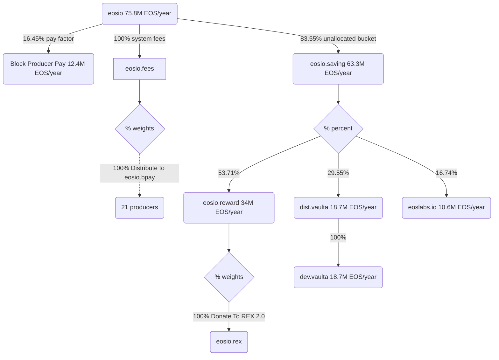

# Development Team Account Setup

> Vaulta Core Development Team Configuration

### Fund Distribution Flow



### Allocations

| Sender | Receiver | Allocation (%)| 
|--------|----------|---------------|
| eosio.saving | eosio.reward | 53.71% |
| eosio.saving | dist.vaulta | 29.55% |
| eosio.saving | eoslabs.io | 16.74% |
| dist.vaulta | dev.vaulta | 100% |

### Account Structure

**dev.vaulta** - Development team multi-sig account (2-of-2)
- ahayrapetian@active (Areg)
- aaron@active (Aaron)

**dist.vaulta** - Distribution contract account
- Controlled by network authority
- Runs eosio.saving contract
- Distributes 100% of incoming funds to dev.vaulta

### MSIG - Development Team Setup

#### Create Accounts

- [x] 1.1 Create `dev.vaulta` account with 2-of-2 multi-sig authority (ahayrapetian + aaron)
- [x] 1.2 Create `dist.vaulta` account with network authority

#### Deploy Distribution Contract

- [x] 2.1 Deploy `eosio.saving` contract to `dist.vaulta`
- [x] 2.2 Set contract ABI for `dist.vaulta`

**setcode**
```json
{
    "account": "dist.vaulta",
    "code": "build/contracts/eosio.saving/eosio.saving.wasm",
    "vmtype": 0,
    "vmversion": 0
}
```

**setabi**
```json
{
    "account": "dist.vaulta",
    "abi": "build/contracts/eosio.saving/eosio.saving.abi"
}
```

#### Configure Distribution Strategies

- [x] 3.1 Configure `dist.vaulta` to distribute 100% to `dev.vaulta`

**dist.vaulta::setdistrib**
```json
{
    "accounts": [
        {
            "account": "dev.vaulta",
            "percent": 10000
        }
    ]
}
```

- [x] 3.2 Update `eosio.saving` distribution to include `dist.vaulta` (29.55%)

**eosio.saving::setdistrib**
```json
{
    "accounts": [
        {
            "account": "eosio.reward",
            "percent": 5371
        },
        {
            "account": "dist.vaulta",
            "percent": 2955
        },
        {
            "account": "eoslabs.io",
            "percent": 1674
        }
    ]
}
```

#### Update Permissions

- [x] 4.1 Update `fund.wram` active permission to network authority (replace eosio.grants@active with eosio@active)

**updateauth**
```json
{
    "account": "fund.wram",
    "auth": {
        "threshold": 1,
        "keys": [],
        "accounts": [
            {
                "weight": 1,
                "permission": {
                    "actor": "eosio",
                    "permission": "active"
                }
            }
        ],
        "waits": []
    },
    "permission": "active",
    "parent": "owner"
}
```

- [x] 4.2 Update `eosio.mware` active permission to dev.vaulta 2-of-2 authority

**updateauth**
```json
{
    "account": "eosio.mware",
    "auth": {
        "threshold": 2,
        "keys": [],
        "accounts": [
            {
                "weight": 1,
                "permission": {
                    "actor": "ahayrapetian",
                    "permission": "active"
                }
            },
            {
                "weight": 1,
                "permission": {
                    "actor": "aaron",
                    "permission": "active"
                }
            }
        ],
        "waits": []
    },
    "permission": "active",
    "parent": "owner"
}
```
