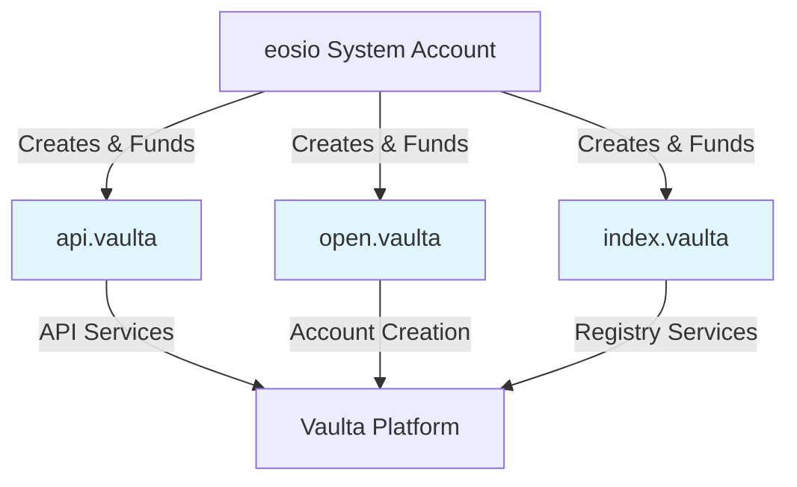

# Miscellaneous Vaulta Accounts Setup

> Infrastructure accounts for Vaulta platform services

### Account Overview

This proposal creates three essential infrastructure accounts for the Vaulta platform:



### Account Structure

**api.vaulta** - API Contract
- Provides readonly API calls for core network functionality
- Owner: eosio@active (Network Authority)
- Active: dev.vaulta@active
- RAM: 8192 bytes

**open.vaulta** - Account Creation Contract
- Allows account creation with a token transfer
- Owner: eosio@active (Network Authority)
- Active: dev.vaulta@active
- RAM: 8192 bytes

**index.vaulta** - Registry Contract
- Maintains registry and indexing services
- Owner: eosio@active (Network Authority)
- Active: dev.vaulta@active
- RAM: 8192 bytes

### Permission Structure

**Owner Permission (Network Authority)**
```json
{
    "threshold": 1,
    "keys": [],
    "accounts": [
        {
            "weight": 1,
            "permission": {
                "actor": "eosio",
                "permission": "active"
            }
        }
    ],
    "waits": []
}
```

**Active Permission (Development Authority)**
```json
{
    "threshold": 1,
    "keys": [],
    "accounts": [
        {
            "weight": 1,
            "permission": {
                "actor": "dev.vaulta",
                "permission": "active"
            }
        }
    ],
    "waits": []
}
```

### MSIG - Miscellaneous Accounts Creation

#### Create Infrastructure Accounts

- [ ] 1.1 Purchase 8192 bytes of RAM for `api.vaulta`
- [ ] 1.2 Create `api.vaulta` account with network owner and dev team active permissions

**buyrambytes**
```json
{
    "payer": "eosio",
    "receiver": "api.vaulta",
    "bytes": 8192
}
```

**newaccount**
```json
{
    "creator": "eosio",
    "name": "api.vaulta",
    "owner": {
        "threshold": 1,
        "keys": [],
        "accounts": [
            {
                "weight": 1,
                "permission": {
                    "actor": "eosio",
                    "permission": "active"
                }
            }
        ],
        "waits": []
    },
    "active": {
        "threshold": 1,
        "keys": [],
        "accounts": [
            {
                "weight": 1,
                "permission": {
                    "actor": "dev.vaulta",
                    "permission": "active"
                }
            }
        ],
        "waits": []
    }
}
```

- [ ] 2.1 Purchase 8192 bytes of RAM for `open.vaulta`
- [ ] 2.2 Create `open.vaulta` account with network owner and dev team active permissions

**buyrambytes**
```json
{
    "payer": "eosio",
    "receiver": "open.vaulta",
    "bytes": 8192
}
```

**newaccount**
```json
{
    "creator": "eosio",
    "name": "open.vaulta",
    "owner": {
        "threshold": 1,
        "keys": [],
        "accounts": [
            {
                "weight": 1,
                "permission": {
                    "actor": "eosio",
                    "permission": "active"
                }
            }
        ],
        "waits": []
    },
    "active": {
        "threshold": 1,
        "keys": [],
        "accounts": [
            {
                "weight": 1,
                "permission": {
                    "actor": "dev.vaulta",
                    "permission": "active"
                }
            }
        ],
        "waits": []
    }
}
```

- [ ] 3.1 Purchase 8192 bytes of RAM for `index.vaulta`
- [ ] 3.2 Create `index.vaulta` account with network owner and dev team active permissions

**buyrambytes**
```json
{
    "payer": "eosio",
    "receiver": "index.vaulta",
    "bytes": 8192
}
```

**newaccount**
```json
{
    "creator": "eosio",
    "name": "index.vaulta",
    "owner": {
        "threshold": 1,
        "keys": [],
        "accounts": [
            {
                "weight": 1,
                "permission": {
                    "actor": "eosio",
                    "permission": "active"
                }
            }
        ],
        "waits": []
    },
    "active": {
        "threshold": 1,
        "keys": [],
        "accounts": [
            {
                "weight": 1,
                "permission": {
                    "actor": "dev.vaulta",
                    "permission": "active"
                }
            }
        ],
        "waits": []
    }
}
```

### Execution

To execute this proposal:

```bash
# Navigate to the proposal directory
cd proposals/misc.accounts

# Run the proposal script
bun run index.ts
```

This will generate a multisig proposal that can be reviewed and approved by the network authority (eosio@active).

### Security Considerations

- **Owner Permission**: Controlled by network authority (eosio@active) for ultimate security and recovery
- **Active Permission**: Delegated to dev.vaulta@active for operational control
- **RAM Allocation**: Each account receives 8192 bytes, sufficient for basic contract deployment and operations
- **System Funded**: All RAM costs are paid by the eosio system account
